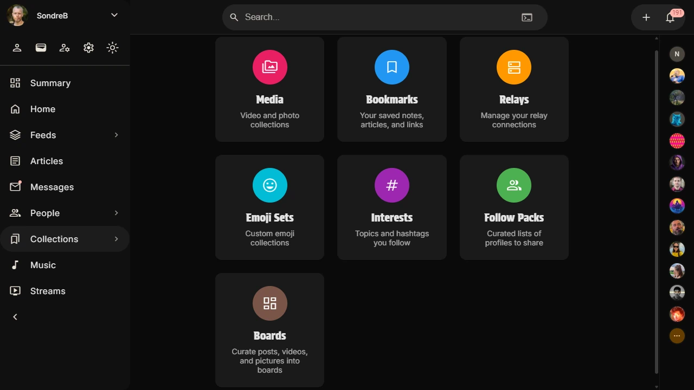
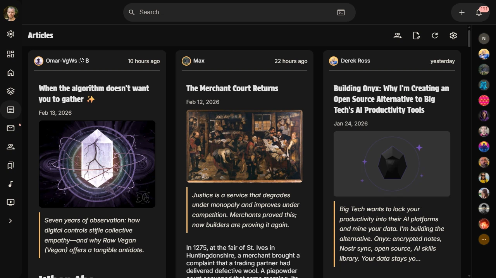
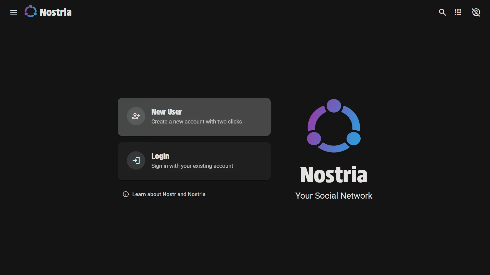
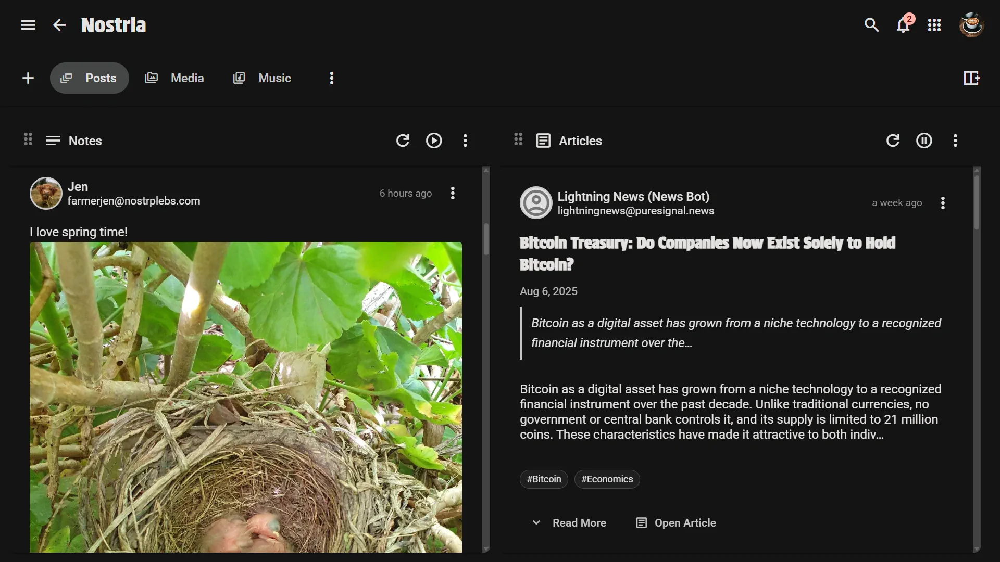

# From Bookmarks to Published Stories: Why Nostria’s Article Editor Feels So Good

Long-form writing on social protocols usually feels like a compromise: either you get speed without structure, or formatting without flow.

Nostria’s article editor changes that. It is designed for the exact way modern creators work: collecting ideas over time, shaping them fast, and publishing with confidence.

In this guide, we’ll walk through the workflow that makes it stand out.

## 1) Start with your Bookmark Lists, not a blank page

Great articles often begin as fragments: a post you saved last week, an event thread from yesterday, and a profile you want to reference.

Nostria lets you turn that scattered research into structure quickly.

Inside the editor, choose **Insert Reference** and open the reference picker. You can pull references from:

- pasted `npub` / `nevent` / `naddr`
- cached profiles
- cached events
- **Bookmark Lists** (insert all references from a list in one step)

That single “insert all” action is the magic moment: your curated bookmarks become the backbone of your article instantly.

## 2) Write in rich text, keep markdown compatibility

Nostria is not locked into a plain markdown-only experience.

You get a rich text editing flow with formatting actions and writing tools, while still benefiting from markdown compatibility and preview rendering. That means you can write naturally, format confidently, and still publish content that plays nicely with Nostr ecosystems.

For creators, this is the right balance:

- easy formatting when you want speed
- markdown-friendly output when you need portability
- predictable rendering in preview

## 3) Use dual pane to think and refine at the same time

The most productive writing state is when drafting and reading happen together.

Nostria’s dual pane mode gives you exactly that: editor on one side, live article preview on the other. You can tune headings, summaries, references, and spacing while seeing the final reading experience in real time.

This drastically reduces the usual “write → switch tab → check → switch back” friction.

## 4) Polish without leaving the editor

The article editor includes the details that usually force writers into separate tools:

- featured image support (upload, media library, or direct URL)
- title and optional summary fields
- tag management
- auto-generated article ID (`d` tag) with manual override
- import existing article content from `naddr`, Nostria URL, or event JSON

Everything stays in one place, so momentum stays high.

## 5) Draft safety built in

Nostria auto-saves draft changes continuously, so accidental tab closes or context switches don’t destroy your work.

When you are ready, publishing is straightforward. Save drafts while iterating, then publish when the piece is ready for everyone.

## Why this matters for creators on Nostr

Nostr has matured into a serious publishing surface, but many writing tools still feel bolted on.

Nostria’s article editor feels native to long-form work:

- discover and collect first
- compose with references quickly
- edit with rich tools
- validate with live preview
- publish with confidence

If you already use Bookmark Lists, this editor turns your existing reading habit into a repeatable writing system.

---

If you want one workflow to remember, use this:

**Bookmark Lists → Insert References → Rich Edit → Dual Pane Refine → Publish.**
